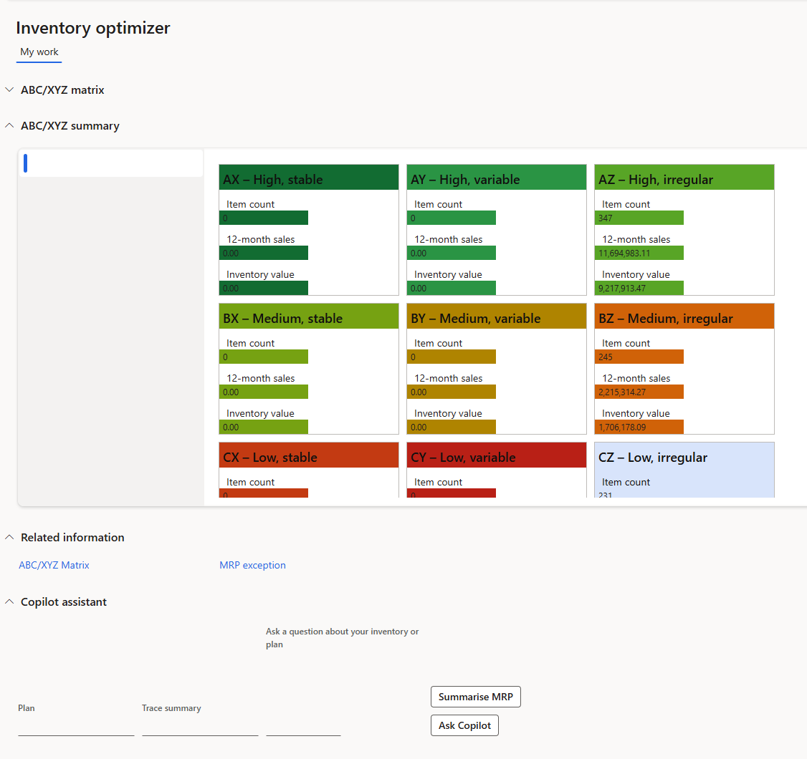
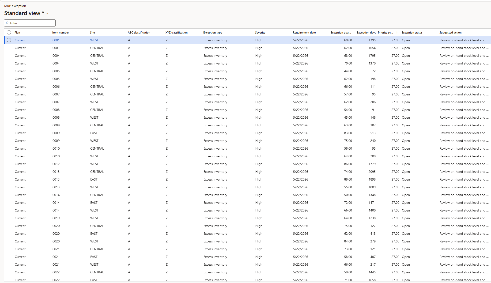

# MRP Assessment tool

**Free Tools for Microsoft Dynamics 365 Finance & Operations**

A powerful set of inventory intelligence tools designed to help planners make better decisions faster.

**Free Features Included:**
- ABC/XYZ Classification Matrix
- MRP Exception Advisor
- MRP Assessment Engine

---

## ✨ What It Does

This solution answers three critical supply chain questions:

| Feature                    | Answers the Question                          | Update Frequency |
|---------------------------|-----------------------------------------------|------------------|
| **ABC/XYZ Classification** | Which items matter most and how predictable is demand? | Monthly |
| **MRP Exception Advisor**  | What supply actions need immediate attention? | After each MRP run |
| **MRP Assessment**         | Can we trust the MRP output?                  | Weekly |

---

## 📸 Screenshots

*ABC/XYZ Matrix*

*(Add your screenshots in the `screenshots/` folder)*

---

## 🚀 Quick Start

### 1. Download the latest package
→ **[⬇️ Download Latest Release](https://github.com/forgestock/mrpassessment/releases)**

### 2. Import into D365FO
- Import the deployable package via LCS or Visual Studio
- Run the following batch jobs in order:

  1. **ABC/XYZ Classification** (Monthly)
  2. **MRP Exception Scan** (After each Master Planning run)
  3. **MRP Assessment** (Weekly)

---

## 📖 User Training Guide

Detailed documentation is available in the repository:

**[📘 Full User Training Guide](./docs/User-Training-Guide.md)**

**Key Sections:**
- How ABC/XYZ Classification works (with 3×3 matrix guidance)
- How to interpret and action MRP Exceptions by priority score
- How to run and understand MRP Assessment results
- Recommended monthly/weekly/daily operating rhythm
- Full menu path reference

---

## 🎯 Key Benefits

- Prioritize high-value unpredictable items (AZ)
- Reduce excess inventory while protecting service levels
- Identify configuration issues that cause bad MRP output
- Provide data-backed justification for parameter changes
- Works with both **Planning Optimization** and Classic MRP

---

## 📊 Supported Environments

- Microsoft Dynamics 365 Finance & Operations (Cloud)
- Compatible with both Classic MRP and Planning Optimization

---

## 📄 License

MIT License — Free for commercial and internal use.

---

## 🤝 Contributing

Contributions, bug reports, and feature requests are welcome!

Feel free to open an **Issue** or submit a **Pull Request**.

---

**Made with ❤️ by Forgestock**

---

### Repository Links

- [Releases](https://github.com/forgestock/mrpassessment/releases)
- [Issues](https://github.com/forgestock/mrpassessment/issues)
- [Full Documentation](./docs/)
